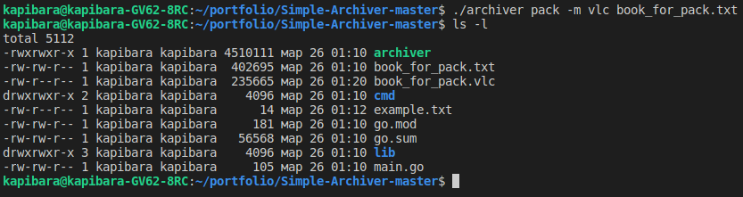

# Simple Archiver v1.0

Простой архиватор с алгоритмом Шеннона-Фано. 

# Хочу выразить благодарность автору канала "Николай Тузов"

 
   

**Ссылка на канал - https://www.youtube.com/@nikolay_tuzov**

***Благодаря урокам автора, я смог создать данный архиватор***

# Логика архиватор

***./archiver pack -m vlc ...(имя файла)- Архивация в формат vls***

***./archiver pack -m vlc ...(имя файла)- Разархивация в формат vlc***

# Работа архиватора

**Сжимаем файл с небольшим содержанием**
 
   

Размер увеличился, т.к. вшита таблица АСКИ
 
**Сжимаем большой файл**

   

Размер сжался в 2 раза!